# Lab4web
layout sederhana

## membuat halaman layout sederhana
1. pertama membuat dokumen html nya

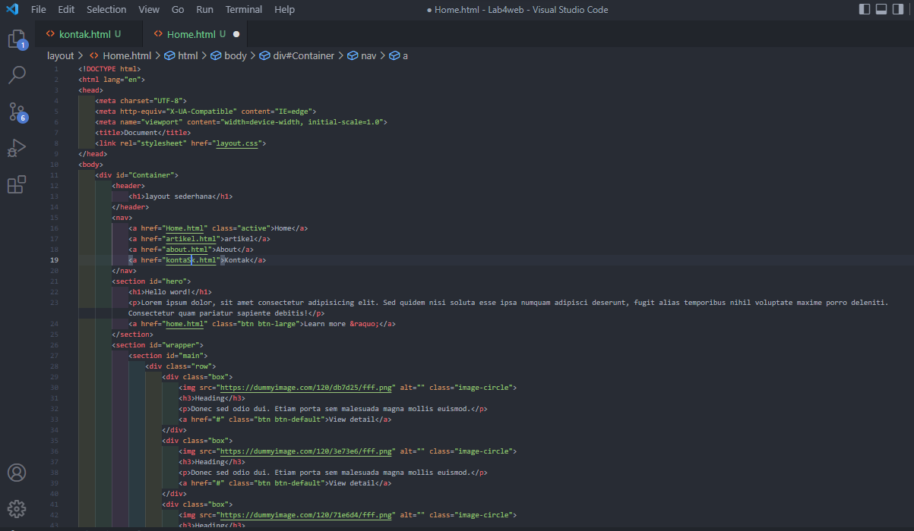

2. kemudian menambahkan CSS

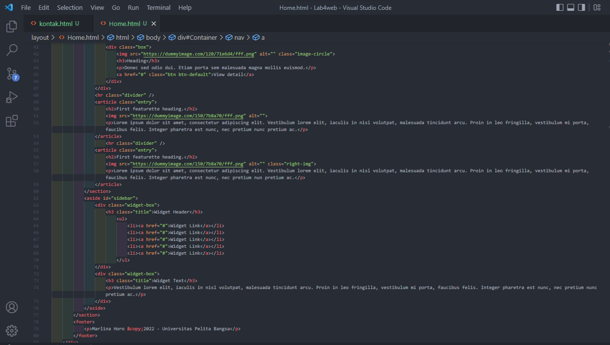

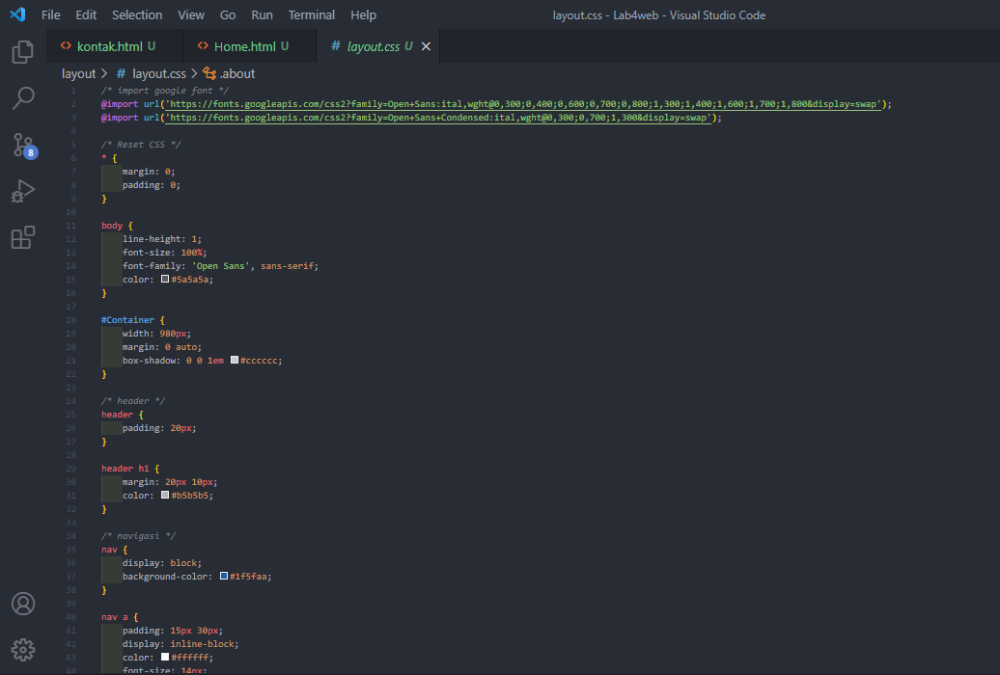

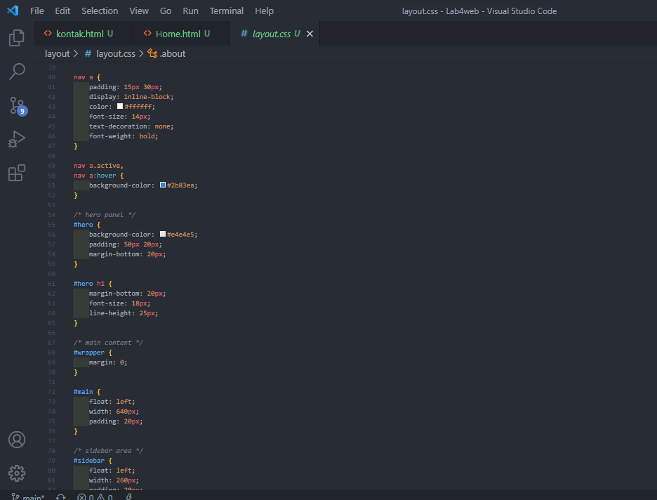

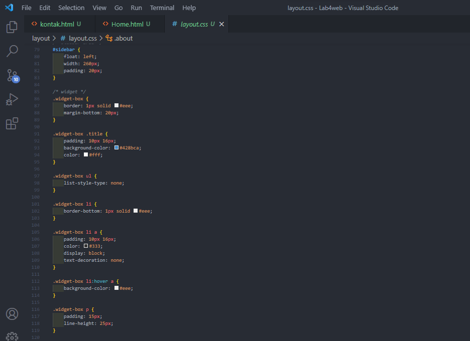

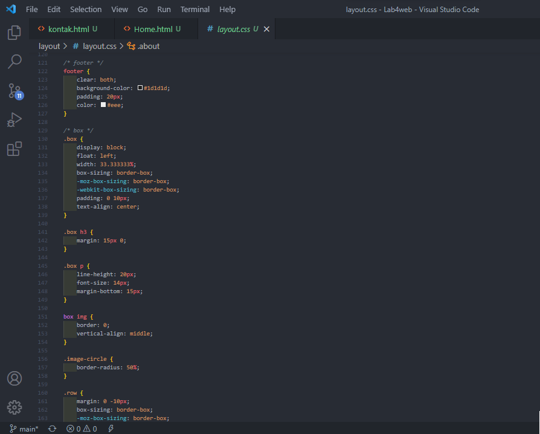

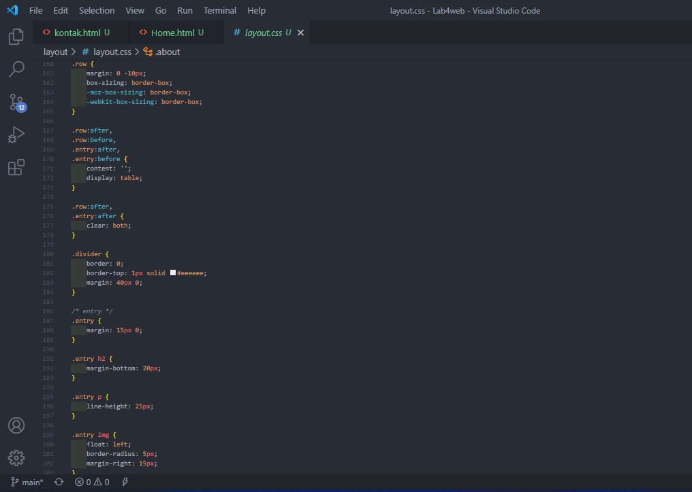

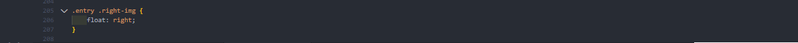

3. Hasil

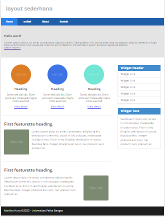

## Membuat layout about

1. membuat dokumen html

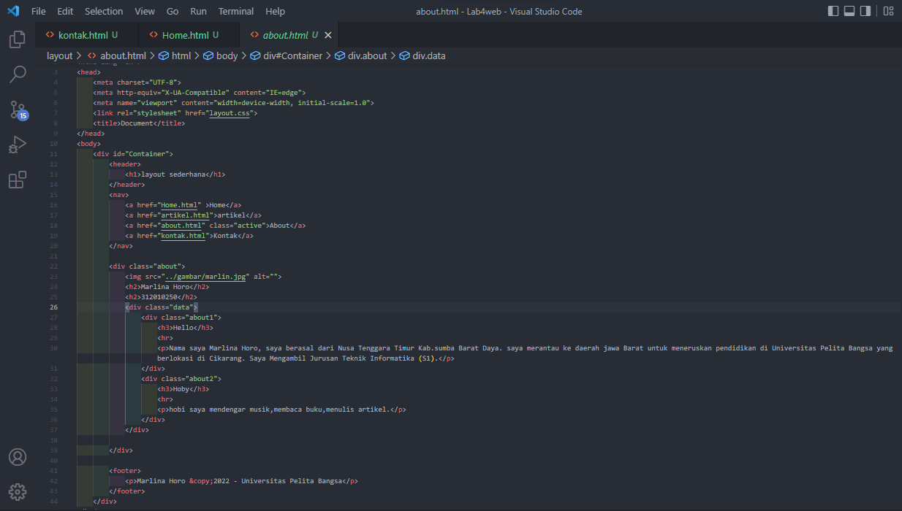

2. Dan Menambahkan CSS

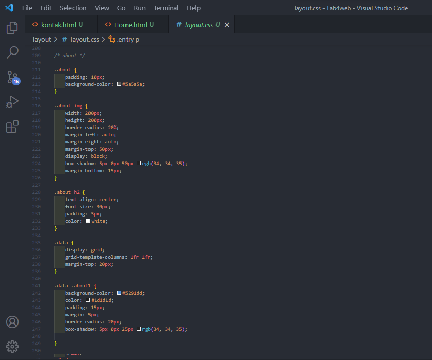

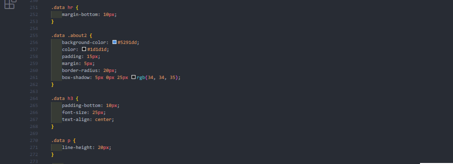

3. Hasilnya

## membuat Kontak

1. html kontak

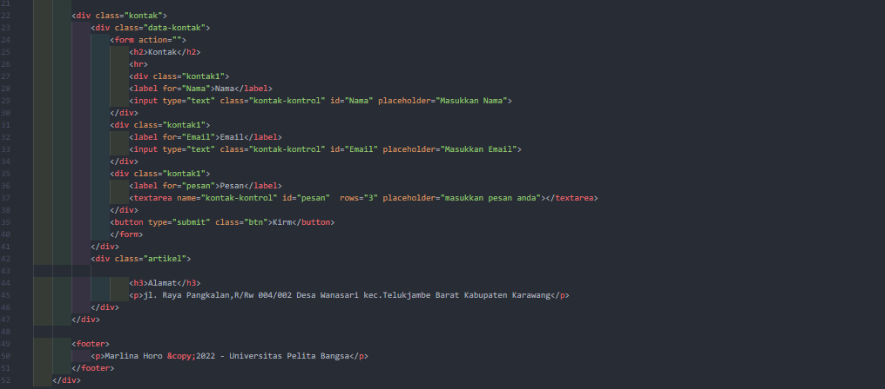

2. CSS Kontak

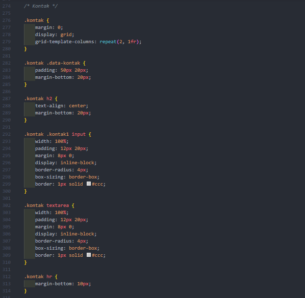

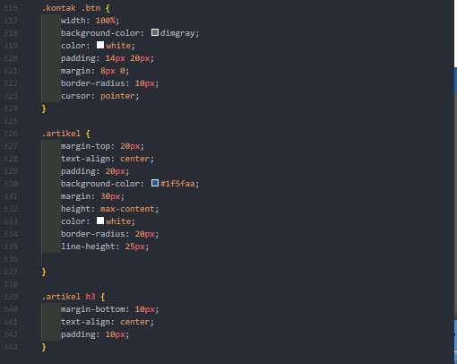

3. Hasil

