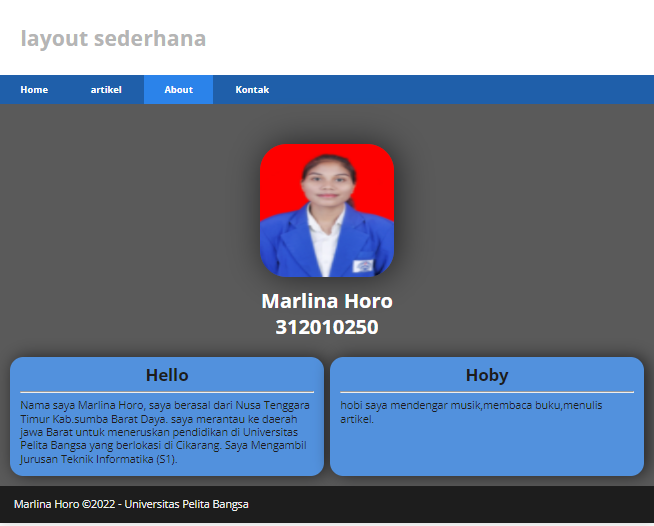
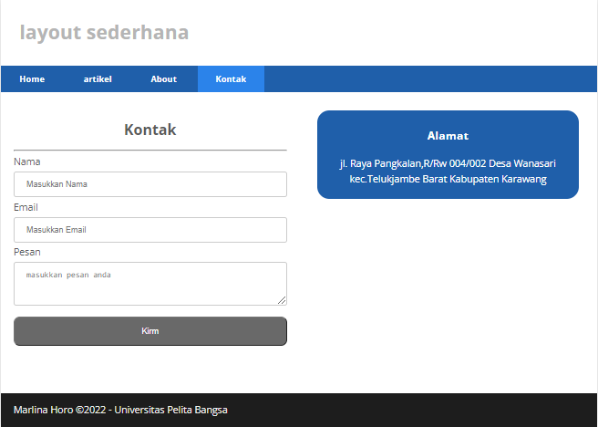

# Lab4web
layout sederhana

## membuat halaman layout sederhana
1. pertama membuat dokumen html nya

2. kemudian menambahkan CSS

3. Hasil

## Membuat layout about

1. membuat dokumen html

2. Dan Menambahkan CSS

3. Hasilnya

## membuat Kontak

1. html kontak

2. CSS Kontak

3. Hasil

